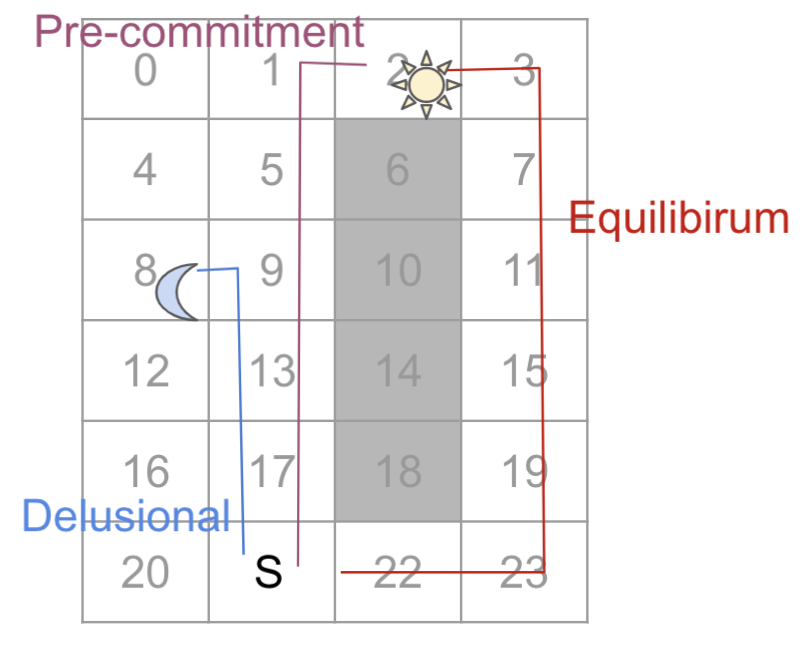

# Experiment Instructions
### This file intends to provide detailed instructions on how to reproduce the experiments in our [paper]().
The main setup of the experiments consists of two parts. The first is algorithms, and the second is the environment. We also provide an explanation on how to collect the result data.

## 1. Algorithms
We have used 3 algorithms in this paper. The Vanilla method, _i.e._ Monte Carlo, and the recursive methods, _i.e._, the Soph-EU-Agent and the E. The pseudo-code of the 3 algorithms are included in the Appendix A of our paper.

### 1.1 MC
For this method, we modify the standard textbook implementation of on-policy MC method to use hyperbolic discounting.

### 1.2 Soph-EU-Agent (Forward)
This is the method that we refer to as 'forward'. 

### 1.3 Equilbrium Q-Iteration (Backward)
This is the method that we refer to as 'backward'.

## 2. Environment
In this part, we describe how to implement the environments.

### 2.1 Simple Gridworld
Our devise an gridworld environment as shown in the following graph:

In the code, we implement the gridworld as shown by the following: 

    o  o  S  o
    o  o  X  o
    M  o  X  o
    o  o  X  o
    o  o  X  o
    o  S  o  o
    

### 2.2 Windy Gridworld

## 3. Result Collection

### 3.1 Q/Expected Utility Values
Mean and Std.dev

### 3.2 Number of Revisits
